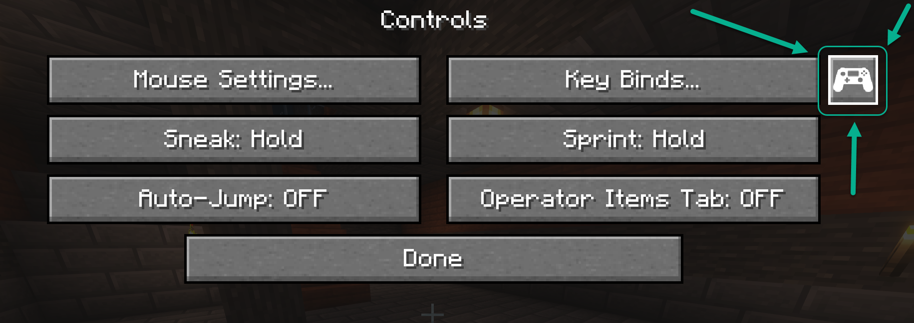
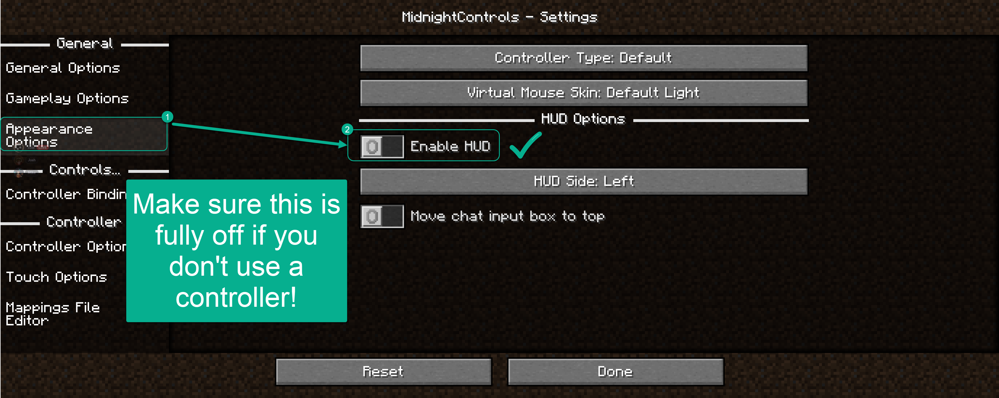

# 🥜 Sneaky Walnut: A Modded Minecraft Adventure

Welcome to **Sneaky Walnut**, a **Minecraft 1.20.1** modpack designed for engineering, automation, and exploration. This pack blends performance-enhancing tools, immersive gameplay mods, and quality-of-life improvements to create the ultimate multiplayer experience.

---

## 🚀 How to Install the Modpack

### Step 1: Install A Launcher

#### Prism
1. Download and install **[Prism Launcher](https://prismlauncher.org/)** (a mod-friendly Minecraft launcher without ads).
2. Sign into your **Minecraft account** within the Prism Launcher.

#### Modrinth
1. Download and install **[Modrinth](https://modrinth.com/app)** (a mod-friendly Minecraft launcher).
2. Sign into your **Minecraft account** within the Modrinth app.

> Also supported:
> - **[MultiMC](https://multimc.org/)**
> - **[ATLauncher](https://www.atlauncher.com/)**
> - **[BakaXL](https://www.bakaxl.com/)**
> - **[Superpack](https://github.com/Gaming32/Superpack/releases)**

### Step 2: Download and Install the Modpack

1. Download the latest modpack release (`Sneaky Walnut 1.0.0.mrpack`) from the **[Releases](https://github.com/mike-bros/sneaky-walnut/releases)** section.
   - _Prism_: Add New Instance > Import > Browse and Select the `.mrpack` file.
   - _Modrinth_: Open the `.mrpack` file with **Modrinth**, then launch the instance.
2. Ensure the modpack profile will launch with **minimum memory of 4GB**, _recommended 8GB-16GB_, depending on your system.
3. The modpack **already includes the server IP**, but if needed, manually enter:

    ```
    bros.ninja
    ```

---

## 📚 Mod List & Features

This modpack includes a selection of **Create Fabric**, **automation**, **quality-of-life**, and **performance mods** to enhance your experience.

### ⚙️ Core Gameplay Mods

- **Create Fabric** – Mechanical contraptions, automation, and engineering.
- **Tom's Simple Storage** – Scalable storage with sorting and automation.
- **Custom Planes** – Fly custom-built planes in Minecraft.

### ✨ Quality of Life Improvements

- **Automatic Doors** – Doors open automatically when players approach.
- **Styled Player List** – Enhances player list UI with colors and info.
- **Your Items Are Safe** – Prevents item de-spawning after death if the player has enough wood available.

### 🧭 Navigation & Mapping

- **BlueMap** – A live 3D web-based map of the world. Access it at **[bros.ninja:8100](http://bros.ninja:8100)**.
- **JourneyMap** – In-game minimap with waypoints and world tracking.

### 🛠️ Server Tools

- **Chunky** – Pre-generates world chunks to reduce lag.
- **Essential Commands** – Adds commands like teleportation, home setting, and permissions.
- **Fabric API** – Required for most Fabric mods.

See the **full mod list** in the `mods.md` on GitHub.

---

## ⛔ Keybind Incompatibilities
Some keybinds may conflict with the modpack. If you experience issues, check the following:

- **Iris Shaders** | `R` – Used to reload shaders, suggestion is `;`.
   - Conflicts with **Immersive Aircraft** Dismount keybind.
- **Iris Shaders** | `O` - Shaderpack selection screen, suggestion is `'`.
   - Conflicts with **Immersive Aircraft** Dismount keybind.
- **Gameplay _(Tom's Simple Storage)_** | `B` - Open the terminal, supposedly used for remote access. Suggestion is set to `V`.
   - Conflicts with **Immersive Aircraft** Rocket Boost keybind.
- **JourneyMap** | `B` - Create waypoint, suggestion is to set to `]`.
   - Conflicts with **Immersive Aircraft** Rocket Boost keybind.

---

## 🎮 Gamepad Controller Mod
The gamepad controller mod is great, but if you don't need it and want to hide the annoying controller HUD, you can disable it in the mod settings:

1. Open **Controls** in the game menu and click the controller icon next to "Key Binds...".
   
2. In MidnightControls Settings, click "Appearance Options" from the left, and to ensure "Enabled HUD" is toggled off.
   

---

## 📦 Download Latest Modpack Version

You can always get the latest version of the modpack from the **[Releases](https://github.com/mike-bros/sneaky-walnut/releases)** page.

---
